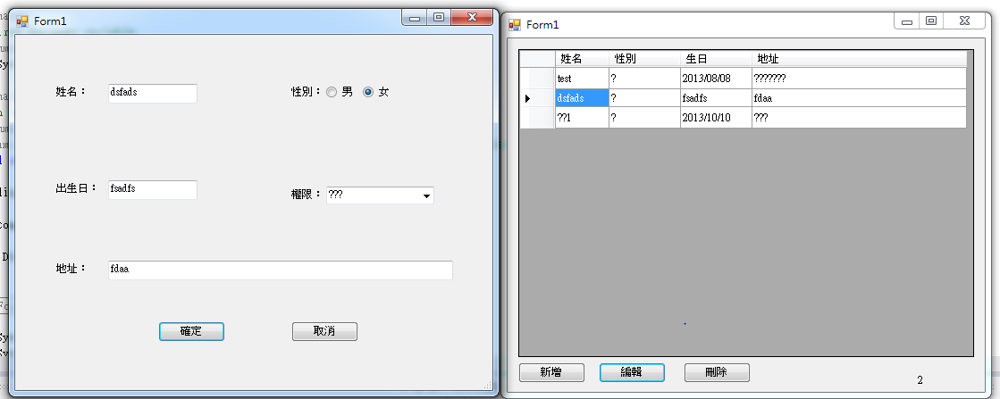

## 1. Discuss UI from the frontend to the backend(1430 - 1520) ##
### 整合 ###
- 製作者：Zack
- 時間：2013/12/11 23:59開始

### 公版 ###
- 製作者：Rebecca
- 時間：2013/12/09

### Layout ###
- 增、刪、改、查的樣板如下：

## 2. Git教學(1530 - 1620) ##
### 使用步驟如下 ###
1. 請先commit你更改的檔案, 並勾選和設定時間和簽名
2. commit後先使用pull, 再push檔案
3. 切記勿更改別人的程式!!!!

## 3. Data schema(1630 - 1720) ##
### 請依照需求更改 ###

## 4. Everyone's achievement so far(1730 - 1750) ##
### A. Rebecca工作進度 ###
#### 目前進度 ####
1. 資料庫聯結和增刪改查完成

### 後續進度 ###
1. 首頁、登入和登出、列印報表(請在12/11前交給Zack)
2. Rebecca資料庫能連上(12/22 check)

### B. Zack工作進度 ###
#### 目前進度 ####
1. 管理員工的增刪改查完成

### 後續進度 ###
1. 調整專案甘特圖
2. 整合所有人的圖
3. 確認NAS server可以連上

### C. Xavier工作進度 ###
#### 目前進度 ####
1. 管理電影的增刪完成(缺改查)

### 後續進度 - UI ###
1. 管理電影、列印兌換券(請在12/11前交給Zack)
2. 完成改查

### D. Jason工作進度 ###
#### 目前進度 ####
1. 暫無進度

### 後續進度 ###
1. 出售票券、退還票券、查詢票券(請在12/11前交給Zack)